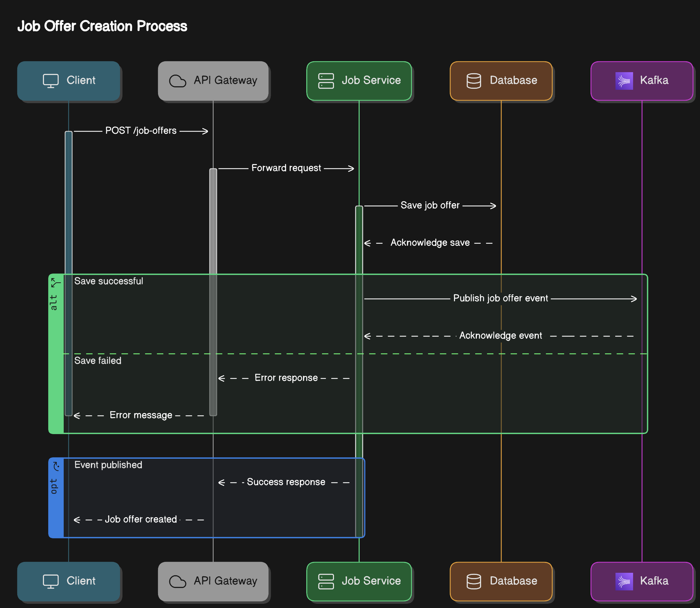

# Job Offer Producer Microservice

This microservice provides a REST API for creating new job offers. It saves the job offers in a MySQL database and creates a new Kafka topic.

## Schema

The project schema is illustrated in the following diagram:

## Project Structure

The project is organized into the following directories:

* `src/main/java`: contains the Java source code for the microservice
* `src/main/resources`: contains the application properties and static resources
* `docker`: contains the Dockerfile and configuration files for building and running the microservice as a Docker container

## Dependencies

The project depends on the following libraries and frameworks:

* Spring Boot
* MySQL
* Kafka
* Tomcat

## Setup

To build and run the microservice, follow these steps:

1. Build the Docker image by running the command `docker build -t job-offer-producer .` in the project root directory.
2. Run the Docker container by running the command `docker run -p 8080:8080 job-offer-producer`.
3. Access the REST API by sending a POST request to `http://localhost:8080/publish` with the job offer details in the request body.

## API Endpoints

The microservice provides the following API endpoints:

* `POST /publish`: creates a new job offer and saves it in the MySQL database and creates a new Kafka topic.

## Environment Variables

The microservice uses the following environment variables:

* `JAVA_OPTS`: sets the Java options for the Tomcat server
* `CATALINA_HOME`: sets the home directory for the Tomcat server
* `TOMCAT_VERSION`: sets the version of the Tomcat server

## Troubleshooting

For troubleshooting tips and common issues, refer to the [TROUBLESHOOTING.md](TROUBLESHOOTING.md) file.
